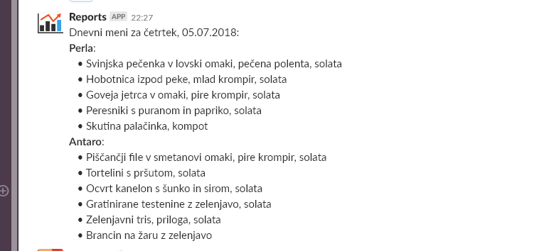

# Daily Lunch Menu fetcher

**Note:** This branch (`opencv-fenix`) is more of a OpenCV playground/test. During the development it was realized that OpenCV is pure overkill for this job.

This is a simple script made for fun which is automatically run every (working) day via Task Scheduler to report daily lunch menus of nearby restaurants to our Slack workspace.

This is how this looks in the Slack channel:

